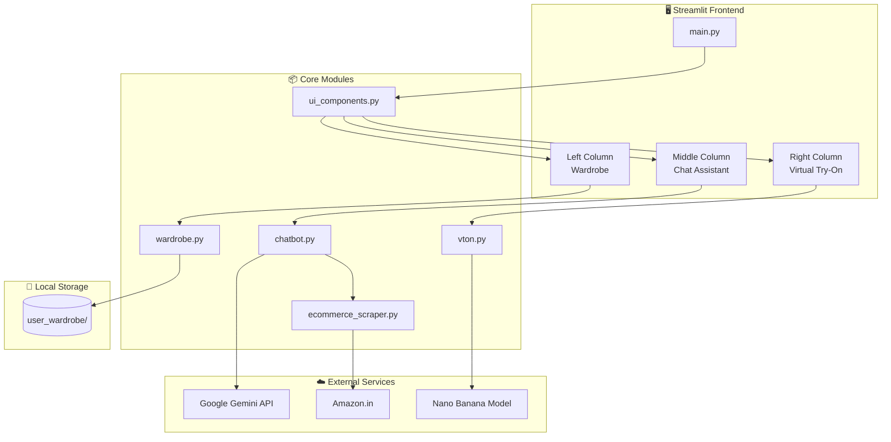
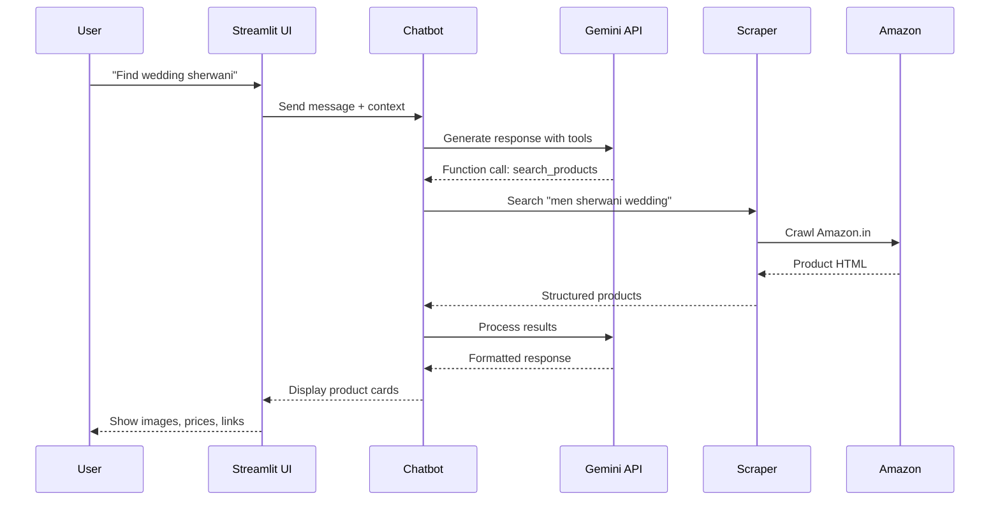

# 👗 FashionFrenzy - AI-Powered Style Studio

<div align="center">


**An intelligent personalized wardrobe curator with AI-powered styling, product search, and virtual try-on capabilities.**

[Features](#-features) • [Architecture](#-architecture) • [Installation](#-installation) • [Usage](#-usage) • [Docker](#-docker)

</div>

---

## ✨ Features

| Feature | Description |
|---------|-------------|
| 🗂️ **Wardrobe Management** | Upload, categorize, and organize your clothing by body region |
| 💬 **AI Style Assistant** | Chat with Gemini-powered assistant for outfit recommendations |
| 🛒 **Smart Product Search** | Automatically scrapes Amazon for products matching your needs |
| 🪄 **Virtual Try-On** | See how clothes look on you using Nano Banana AI model |
| 🎯 **Gender-Aware Recommendations** | Personalized suggestions based on your gender preference |

---

## 🏗️ Architecture



### Component Flow



---

## 📁 Project Structure

```
Fashion_frenzy/
├── main.py                     # 🚀 Entry point - Streamlit app
├── pyproject.toml              # 📦 Project dependencies (uv)
├── uv.lock                     # 🔒 Locked dependencies
├── Dockerfile                  # 🐳 Docker configuration
├── .dockerignore               # 🚫 Docker ignore rules
├── banana_list.txt             # 🍌 Model configuration
│
├── modules/
│   ├── __init__.py             # Package initializer
│   ├── ui_components.py        # 🎨 UI rendering (3-column layout)
│   ├── wardrobe.py             # 👔 Wardrobe file management
│   ├── chatbot.py              # 🤖 Gemini AI chat with tools
│   ├── vton.py                 # 🪄 Virtual try-on generation
│   └── ecommerce_scraper.py    # 🕷️ Amazon product scraper
│
└── user_wardrobe/              # 📂 User's clothing storage
    ├── above_head/             # Hats, hair accessories
    ├── on_face/                # Glasses, masks
    ├── on_neck/                # Necklaces, scarves
    ├── upper_body/             # Shirts, jackets, tops
    ├── lower_body/             # Pants, skirts, shorts
    ├── feet/                   # Shoes, socks
    └── special_overlap/        # Sarees, drapes
```

---

## 🚀 Installation

### Prerequisites

- Python 3.12+
- [uv](https://docs.astral.sh/uv/) (fast Python package manager)
- Gemini API Key ([Get one here](https://aistudio.google.com/app/apikey))

### Setup with uv

```bash
# Clone the repository
git clone https://github.com/aadarshpandey/fashion-frenzy.git
cd fashion-frenzy

# Install uv (if not installed)
curl -LsSf https://astral.sh/uv/install.sh | sh

# Create virtual environment and install dependencies
uv venv
source .venv/bin/activate  # Linux/Mac
# .venv\Scripts\activate   # Windows

# Install dependencies
uv sync

# Install Playwright browser (for web scraping)
uv run playwright install chromium
```

### Adding New Dependencies

```bash
# Add a new package
uv add package-name

# Add development dependency
uv add --dev package-name
```

---

## ▶️ Usage

### Run the Application

```bash
# Activate virtual environment
source .venv/bin/activate

# Run Streamlit app
uv run streamlit run main.py
```

Open your browser at `http://localhost:8501`

### First Time Setup

1. Enter your **Gemini API Key** on the welcome screen
2. Select your preferred **AI models**:
   - Style Assistant: `gemini-2.0-flash` (recommended)
   - Virtual Try-On: `models/nano-banana-pro-preview`
3. Click **"Connect & Start Styling"**

### Features Guide

#### 👗 Wardrobe Management (Left Column)
- Upload clothing images (JPG, PNG)
- Categorize by body region
- View inventory by category
- Delete items with 🗑️ button

#### 💬 Style Assistant (Middle Column)
- Select gender (Male/Female) for targeted recommendations
- Ask for outfit suggestions
- Request product searches: *"Find me a red kurta for Diwali"*
- Get styling tips based on your wardrobe

#### 🪄 Virtual Try-On (Right Column)
- Upload your photo
- Upload a garment image
- Click **"Generate Try-On"** to see how it looks!

---

## 🐳 Docker

### Pull from Docker Hub

```bash
docker pull aadarshpandey/fashion-frenzy:v2
```

### Run Container

```bash
docker run -p 8501:8501 aadarshpandey/fashion-frenzy:v2
```

### Build Locally

```bash
# Build the image
docker build -t aadarshpandey/fashion-frenzy:v2 .

# Run the container
docker run -p 8501:8501 aadarshpandey/fashion-frenzy:v2
```

Open `http://localhost:8501` in your browser.

---

## 🔧 Configuration

### Environment Variables

| Variable | Description | Required |
|----------|-------------|----------|
| `GEMINI_API_KEY` | Google Gemini API key | Yes (or enter in UI) |

### Model Options

**Chat Models:**
- `gemini-2.0-flash` (default, fastest)
- `gemini-2.0-flash-lite`
- `gemini-1.5-flash`
- `gemini-1.5-pro`

**Virtual Try-On Models:**
- `models/nano-banana-pro-preview` (default)
- `gemini-2.0-flash-preview-image-generation`
- `imagen-3.0-generate-002`

---

## 📦 Dependencies

```toml
[project]
requires-python = ">=3.12"
dependencies = [
    "crawl4ai>=0.8.0",
    "google>=3.0.0",
    "google-genai>=1.62.0",
    "google-generativeai>=0.8.6",
    "nest-asyncio>=1.6.0",
    "pillow>=12.1.0",
    "pydantic>=2.12.5",
    "streamlit>=1.54.0",
]
```

---

## 🛠️ Tech Stack

| Technology | Purpose |
|------------|---------|
| **Streamlit** | Web UI framework |
| **Google Gemini** | AI chat & image generation |
| **crawl4ai** | AI-powered web scraping |
| **Playwright** | Browser automation |
| **Pydantic** | Data validation |
| **Pillow** | Image processing |
| **uv** | Fast package management |

---

## 📄 License

MIT License - feel free to use, modify, and distribute.

---

## 🤝 Contributing

1. Fork the repository
2. Create a feature branch: `git checkout -b feature/amazing-feature`
3. Commit changes: `git commit -m 'Add amazing feature'`
4. Push to branch: `git push origin feature/amazing-feature`
5. Open a Pull Request

---

<div align="center">

**Made with ❤️ using Streamlit & Google Gemini**

[⬆ Back to top](#-fashionfrenzy---ai-powered-style-studio)

</div>
